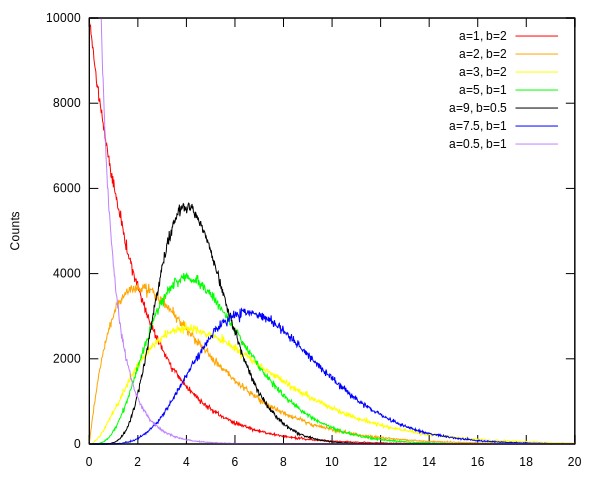
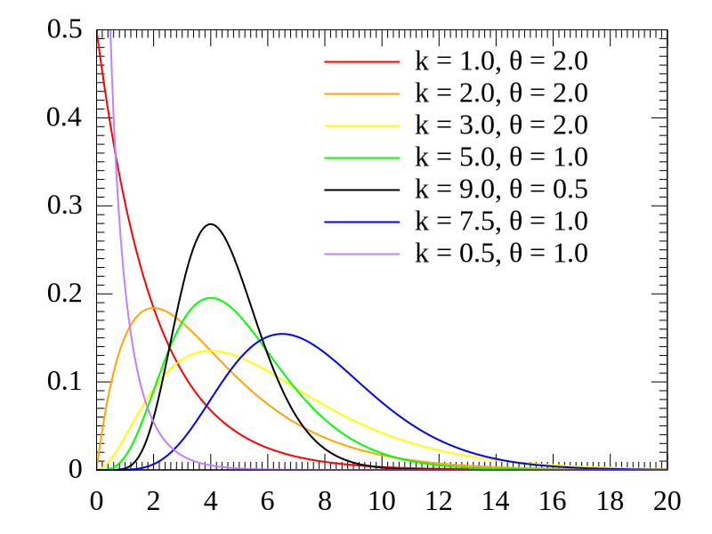

# Gamma deviates
`gamma-dev` implements a pseudorandom number generator for the
Gamma distribution [1].

## Usage
### General gamma
For the general gamma distribution, you need to instantiate a number
generator with the set of parameters you want to use. We use the
following parameters:
* `a` (alpha in [2]): shape parameter
* `b` (beta in [2]): scale parameter

#### Instantiation
**make-gamma-gen** a b => Instance of *gamma-gen*A

```common-lisp
(setf generator (make-gamma-gen a b))
```

Create a pseudorandom number generator for the Gamma distribution with
shape parameter *a* and scale parameter *b*.

#### Drawing
**draw** gamma-gen => Pseudorandom number

```common-lisp
(draw generator)
```

Draw a pseudorandom number using the generator instance.

#### Reading parameters back
You can read back the parameters of the generator with:

```common-lisp
(a generator)
(b generator)
```

## Implementation
We use the algorithm by Tanizaki [2]. It involves a rejection of
uniform variates. We use the in-built `random`.

## Histograms
### General gamma
We generate histograms for the general gamma distribution with some
shape and scale parameters (see [histograms](doc/histograms.lisp)).



This looks good enough when compared with the analytical PDFs plotted
on Wikipedia [3].



## Caveats
* There are some specializations etc. to perform for performance if that is
  what you need.
* The algorithm by Tanizaki [2] is, according to its own author, not the best
  algorithm performance-wise for all choices of parameters. An efficient gamma
  pseudorandom generator would need to incorporate several of these algorithms
  and switch depending on the parameters.

## Test
Launch tests with:

```common-lisp
(asdf:test-system "gamma-dev")
```

Includes a quick performance test.

## Dependencies
* `gamma-dev`: None.
* `gamma-dev/test`:
  * [rove](https://github.com/fukamachi/rove)

## References
1. https://en.wikipedia.org/wiki/Gamma_distribution
2. H. Tanizaki, “A simple gamma random number generator for arbitrary shape
   parameters,” Economics Bulletin 3(7), 1–10 (2008).
3. https://en.wikipedia.org/wiki/File:Gamma_distribution_pdf.svg
